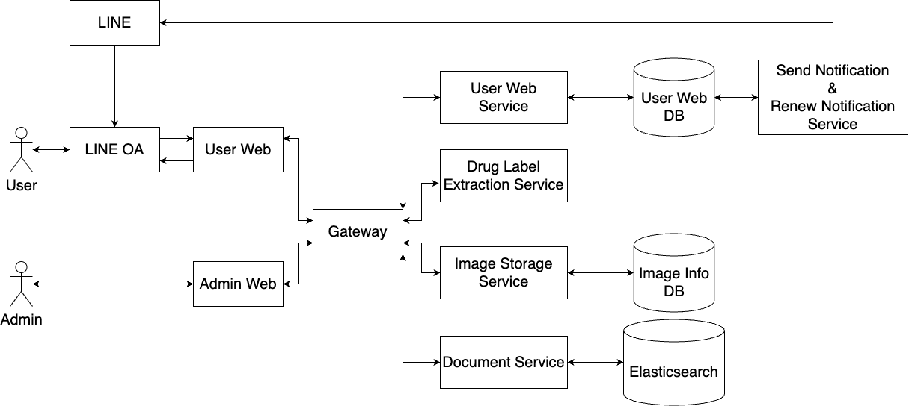

# Contributors
1. ภูมิภัทร เปี่ยมลือ 6310505751
2. สมัชญ์ ห้าวหาญ 6310505769

# Advisors
1. ผศ.ดร. หัชทัย ชาญเลขา

# Co-Advisors
1. ดร. ศิริศิลป์ กองศิลป์

# Introduction
โรงพยาบาลสัตว์มหาวิทยาลัยเกษตรศาสตร์ได้พบกับปัญหาการรักษาสัตว์ไม่มีประสิทธิภาพในบ่อยครั้งเนื่องจากเจ้าของสัตว์เลี้ยงมีการให้ยาในปริมาณที่ไม่ถูกต้องหรือให้ไม่ตรงเวลาทำให้การรักษาไม่มีประสิทธิภาพ ผู้จัดทำจึงได้พัฒนาเว็ปแอปพลิเคชันช่วยแจ้งเตือนการใช้ยาและแนะนำวิธีการใช้ยาและดูแลสัตว์หลังการรักษาที่สามารถใช้ร่วมกับline official account ของโรงพยาบาลได้ โดยเว็ปแอปพลิเคชันนี้สามารถแสกนฉลากที่ได้มาจากโรงพยาบาลสัตว์มหาวิทยาลัยเกษตรศาสตร์เพื่อสร้างการแจ้งเตือนให้ผู้ใช้ได้โดยใช้ Tesseract OCR ในการสกัดข้อความออกมาจากฉลากยาเพื่อเพิ่มความสะดวกในการแจ้งเตือนให้ผู้ใช้งาน การแจ้งเตือนการใช้จะทำการแจ้งเตือนผู้ใช้งานผ่านทางline official account ของโรงพยาบาลสัตว์มหาวิทยาลัยเกษตรศาสตร์ และยังมีเว็ปแอปพลิเคชันสำหรับผู้ดูแลระบบในการเพิ่มข้อมูลยาและวิธีการใช้ยาและดูแลสัตว์หลังการรักษาให้ผู้ใช้งานได้ค้นหาได้อีกด้วย โดยผลการใช้ Tesseract OCR มาช่วยในการสกัดข้อความเพื่อสร้างการแจ้งเตือนนั้นมีความถูกต้องของชื่อยามากถึง70% และเวลาที่ต้องแจ้งเตือน 65% จากผลการทดสอบการใช้OCR จึงช่วยอำนวยความสะดวกในการสร้างการแจ้งเตือนให้ผู้ใช้งานได้

## Designs and Technical
